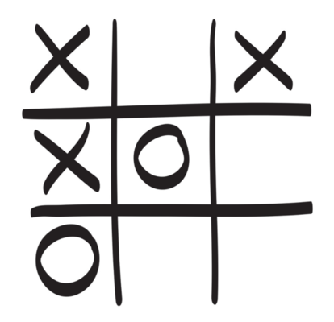

# MinMax Algorithm With Tic Tac Toe

The following code is an attempt at using C++ to code up a bot which plays the game of Tic-Tac-Toe with a player using the MinMax algorithm. This attempt was mostly made to practice my C++ skills.

**This attempt was made with the exclusion of help from any external sources.**



## Some Things To Note

Tic Tac Toe is a **solved** game. Meaning that if both players play the optimal set of moves, the game will always close to a draw. This means that the bot can **never** lose and only draw or win.

## The Algorithm

The **MinMax** Algorithm is an algorithm that employs backtracking to select the optimal decision/move to make in a turn-based game with n players. In this case, Tic Tac Toe is a simple turn based game with n=2 players.

The algorithm recursively travels down a tree of the different possible moves and selects the move which maximises its own score and minimises the score of the other player, effectively **Maximising** itself and **Minimizing** the other player(s) hence being the... *MiniMax* Algorithm. The Coding Train Channel on Youtube does an excellent demonstration of this: https://www.youtube.com/watch?v=trKjYdBASyQ&ab_channel=TheCodingTrain


## How To Play With The Bot

Clone the repository and compile game.cpp with a suitable compiler. Upon finishing this, you should run the .exe file that is produced from compilation and run.

The player who goes first will always be randomly generated by the algorithm, however this can be manually changed through going to the main function and editing the line:

```cpp
int turn = (rand() % 2) + 1; // Generate who's turn it is, either 1 or 2 (To manually set who goes first, set turn to either constant PLAYER or BOT)
```

**Have Fun! /^-^/**
